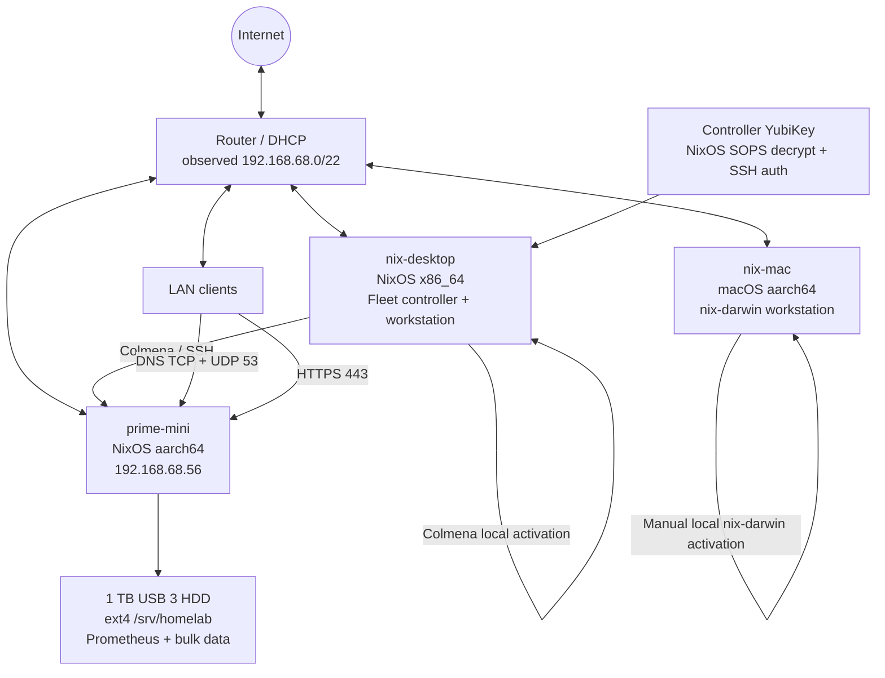
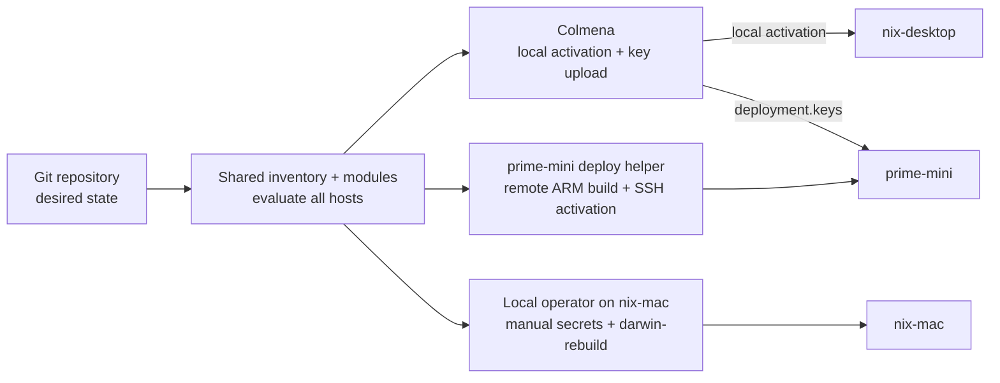
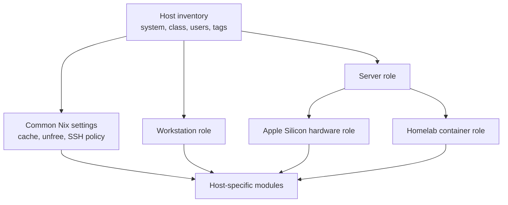
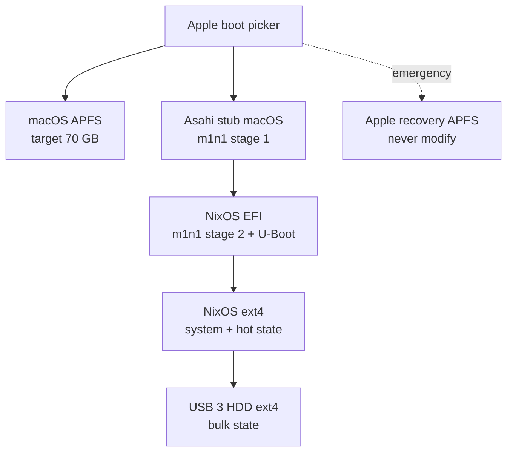
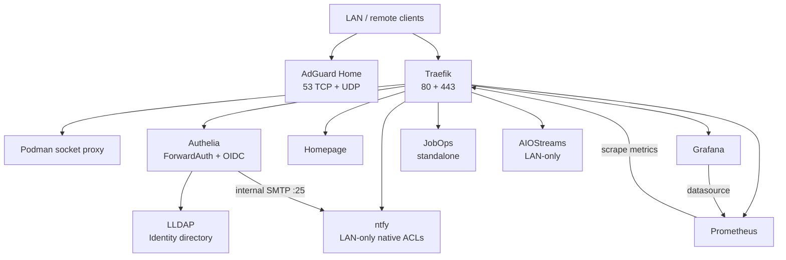
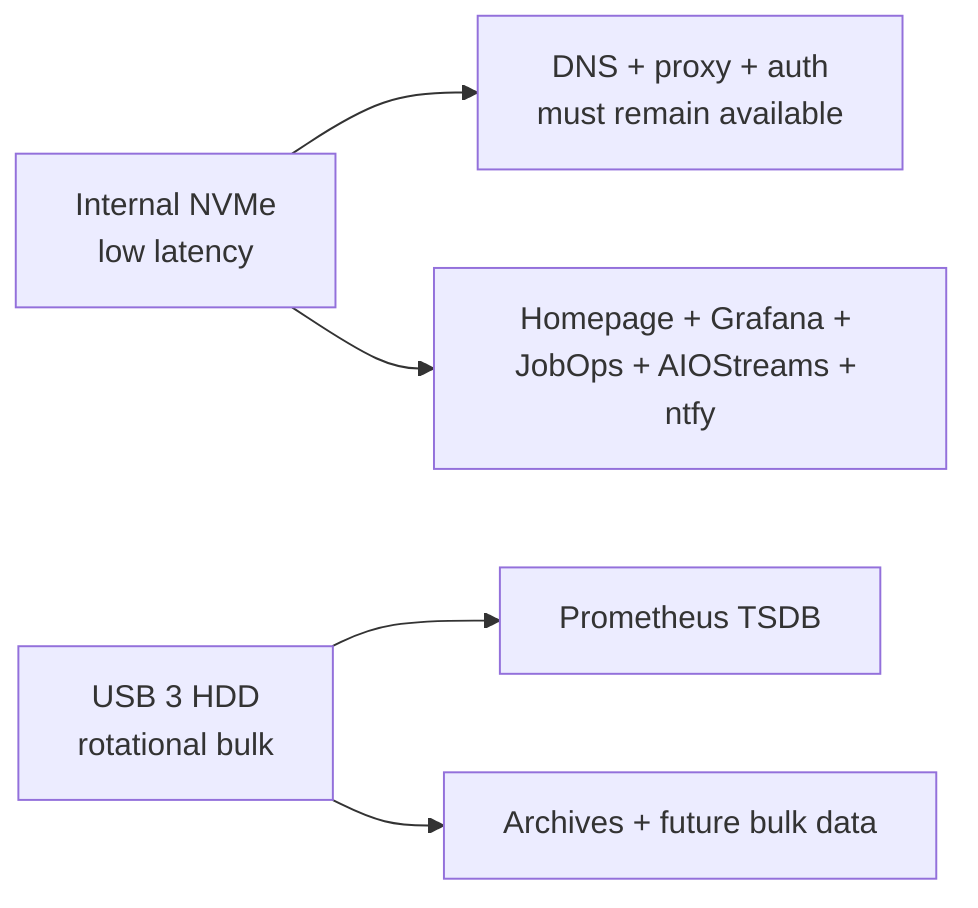
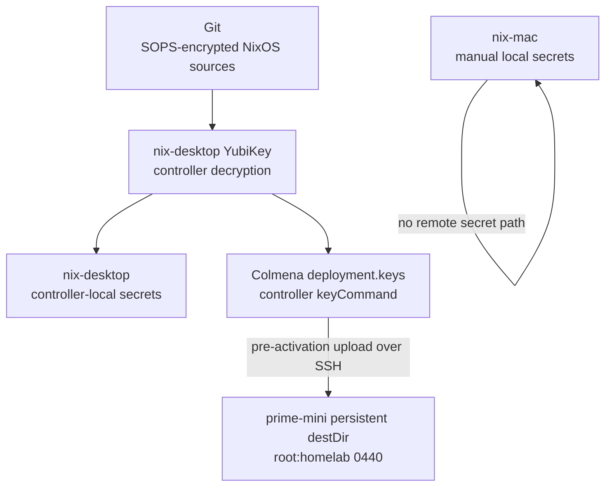

<!-- markdownlint-disable MD013 -->

# Nix Fleet Architecture

> One source of truth for workstations, the homelab, deployment, secrets, and network services

One repository and one flake define `nix-desktop`, `prime-mini`, and `nix-mac` from shared inventory and modules. Colmena activates `nix-desktop` locally and `prime-mini` remotely. `nix-mac` evaluates from the same flake, but its operator performs every nix-darwin activation and secret operation manually and locally on that Mac. Home Manager is integrated into every NixOS and nix-darwin system generation so a host cannot drift between its system and user configuration.

## Architecture Principles

1. One repository and flake are the source of truth for all three hosts.
2. `nix-desktop` is the Colmena controller for NixOS only.
3. The YubiKey attached to `nix-desktop` is the controller identity for NixOS SOPS decryption and remote deployment.
4. Colmena activates `nix-desktop` locally and `prime-mini` over SSH.
5. `nix-mac` activation and secret handling are manual and local; it has no remote-management path.
6. Home Manager is integrated with NixOS and nix-darwin, not switched independently.
7. Workstation and server roles remain separate.
8. `prime-mini` runs NixOS natively; there is no macOS-hosted Linux VM.
9. Core network services do not depend on the old external USB HDD.
10. Required secrets are present before activation.
11. Dependency updates never deploy automatically.

## Fleet Topology



The observed LAN is `192.168.68.0/22`. The router reserves `192.168.68.56` for the built-in Ethernet interface on `prime-mini`. The interface MAC address belongs in router configuration or private inventory, not in this public repository. `nix-mac` uses DHCP and has no reserved-IP requirement.

## Host Inventory

| Host | System | Class | User role | Deployment tags | Addressing |
| --- | --- | --- | --- | --- | --- |
| `nix-desktop` | `x86_64-linux` | Workstation/controller | `julrod` | `nixos`, `workstation`, `controller`, `x86_64` | LAN DHCP |
| `nix-mac` | `aarch64-darwin` | Workstation | `julian` | `darwin`, `workstation`, `aarch64` | LAN DHCP |
| `prime-mini` | `aarch64-linux` | Homelab server | `deploy`, `homelab` | `nixos`, `server`, `homelab`, `aarch64` | DHCP reservation `192.168.68.56` |

### Account Boundaries

| Account | Host | Purpose | Interactive use |
| --- | --- | --- | --- |
| `julrod` | `nix-desktop` | Personal workstation and fleet control | Yes |
| `julian` | `nix-mac` | Workstation profile | Yes |
| `deploy` | `prime-mini` | Colmena SSH and privileged activation | Deployment only |
| `homelab` | `prime-mini` | Rootless Podman, Quadlets, and service files | No normal login |

`deploy` uses UID 1000. `homelab` uses UID 1001 and systemd lingering. Runtime paths must derive from its configured UID rather than repeating a `/run/user/<uid>` path throughout modules.

## Control Plane



### Target Selectors

Colmena selectors apply only to NixOS nodes. The shared inventory may retain platform and role tags for evaluation, but no selector remotely activates `nix-mac`:

| Selector | Hosts |
| --- | --- |
| `nix-desktop` | `nix-desktop` |
| `prime-mini` | `prime-mini` |
| `@homelab` | `prime-mini` |
| `@nixos` | `nix-desktop`, `prime-mini` |
| `@workstations` | `nix-desktop` for Colmena; `nix-mac` remains local-only |
| `@all` | `nix-desktop`, `prime-mini` |

### Deployment Contract

Every fleet activation follows this order:

```text
1. Resolve NixOS node and tag selectors.
2. Record the exact source revision and dirty state.
3. Evaluate every selected NixOS system and integrated Home Manager profile.
4. For `nix-desktop`, validate its controller-local SOPS/YubiKey secrets.
5. For `prime-mini`, use its `ssh-ng` store so evaluation-time ARM Quadlet derivations and the system closure build on the target architecture.
6. Run controller-side `deployment.keys.<name>.keyCommand` and let Colmena upload each `prime-mini` key before activation.
7. Activate `nix-desktop` locally with Colmena or activate the built `prime-mini` closure over SSH.
8. Run platform and application health checks.
9. Report the exact Git revision and activated generations.
```

The `nix-desktop` node sets `deployment.allowLocalDeployment = true` and has no SSH target; it is applied with Colmena's local mode. The `prime-mini` node has the remote `targetHost` and `targetUser`. Local desktop activation must not be implemented by SSHing back into `nix-desktop`.

NixOS activation should normally use `test` before `switch`. Kernel and bootloader changes on `prime-mini` use `boot`, an explicit reboot, and a post-boot promotion gate.

The enabled `prime-mini` Podman stack is an explicit evaluation exception. Home Manager's Quadlet installer reads generated aarch64 unit derivations during evaluation, so the enabled system cannot evaluate on the x86 controller and Colmena cannot produce its deployment derivation. For that configuration, the controller archives the locked flake and inputs to the target store, `prime-mini` evaluates and builds natively, and the operator invokes the resulting `switch-to-configuration` goal remotely. Colmena remains authoritative for controller-side key decryption/upload and for configurations that do not cross this import-from-derivation boundary.

`nix-mac` is a separate local procedure: update its local checkout, evaluate the nix-darwin configuration and integrated Home Manager profile, make required secrets available locally, activate locally, and verify locally. There is no SSH, remote configuration, secret push, deploy-rs, nixos-anywhere, fleet wrapper, or remote Darwin adapter for this host.

Colmena does not provide automatic health rollback. Previous NixOS generations and a locally initiated nix-darwin rollback remain the recovery mechanisms.

## Configuration Boundaries

The flake should describe hosts through inventory data rather than repeating constructors and module lists.



### Workstation Role

Applied to `nix-desktop` and `nix-mac` where platform-compatible:

- Interactive shells and terminal applications
- Editors and language tooling
- Git and GPG client configuration
- Desktop applications
- User preferences
- Development packages
- Integrated Home Manager profile

Platform-specific desktop settings stay in NixOS or Darwin modules and must not leak into the server role.

### Server Role

Applied only to `prime-mini`:

- Headless NixOS
- Apple Silicon support
- Ethernet and OpenSSH
- No desktop, audio, Bluetooth, gaming, or workstation tooling
- Deployment and service accounts
- Rootless Podman and Quadlets
- Persistent secret installation paths
- Internal hot-state and external bulk-state mounts
- Firewall derived from enabled infrastructure
- Health and SMART monitoring

`prime-mini` keeps `system.stateVersion = "26.11"`, matching its first installed NixOS generation. This compatibility value is independent of the flake's target `nixos-26.05` package set and must not be lowered to match the package input.

## Native Apple Silicon Server

`prime-mini` is a 2020 M1 Mac Mini with 8 GB RAM. It dual boots a retained macOS recovery environment and native NixOS.



The 70 GB limit applies to the main macOS APFS container, not the protected recovery partition. Installation stops if the non-expert Asahi installer rejects 70 GB.

The server uses Ethernet only during initial production rollout. Proprietary Apple peripheral firmware is not copied into Git. `hardware.asahi.extractPeripheralFirmware` remains disabled unless a separate private firmware-provisioning design is added.

The native Asahi kernel uses 16 KiB memory pages. Every container image must pass an execution test on `prime-mini`; `linux/arm64` metadata alone is insufficient.

## Homelab Service Topology



### Service Inventory

| Component | Exposure | Authentication | Persistent state | Storage class |
| --- | --- | --- | --- | --- |
| AdGuard | LAN TCP/UDP 53; UI through Traefik | ForwardAuth for UI | Configuration and runtime data | Internal NVMe |
| Traefik | LAN TCP 80/443 | Dashboard through ForwardAuth | ACME data | Internal NVMe |
| Socket proxy | Internal only | Network isolation | None | Internal NVMe |
| Authelia | Internal/Traefik | Primary auth service | SQLite identity and factor state | Internal NVMe |
| LLDAP | Internal; UI through Traefik | ForwardAuth for UI | Identity database | Internal NVMe |
| Homepage | HTTPS through Traefik | ForwardAuth | Generated configuration | Internal NVMe |
| Prometheus | HTTPS through Traefik | ForwardAuth | TSDB with bounded retention | External USB HDD |
| Grafana | HTTPS through Traefik | Authelia OIDC | Database and plugins | Internal NVMe |
| JobOps | HTTPS through Traefik | ForwardAuth | Application data | Internal NVMe |
| AIOStreams | LAN-only HTTPS through Traefik | LAN ingress policy | Application data | Internal NVMe |
| ntfy | LAN-only HTTPS through Traefik; internal SMTP | Native users and topic ACLs | Cache, authentication, and attachments | Internal NVMe |

JobOps has no Reactive Resume dependency. Optional external integrations must be configured independently.

AIOStreams is not internet-published and is reachable only from the observed LAN through Traefik. DNS, router, and firewall configuration must preserve that boundary.

Ntfy is the eleventh target container and provides self-service Authelia identity-validation notifications. Authelia sends plaintext SMTP to `ntfy:25` only across shared Podman networking; TCP 25 and ntfy's HTTP port are not host-published. The HTTPS route uses Traefik's private middleware, has no public DNS record, and disables the default public `ntfy.sh` upstream relay.

Ntfy provisions `julrod` and `cpuerta` from bcrypt verifiers derived on `nix-desktop` from their existing LLDAP passwords. Default-deny ACLs grant each user read-only access to their own enrollment topic, explicitly deny cross-topic access, and grant anonymous write-only access to the two topics for the SMTP receiver. Anonymous LAN clients can therefore spoof a notification on those known topics but cannot read messages; this is an accepted limitation.

### NPS Prerequisites

The server stack depends on Nix Podman Stacks (NPS), but migration must not start until the pinned NPS integration supports and verifies all of the following:

- `nps.hostUid = 1001`, with every Podman socket and runtime path derived from it
- Persistent secret file paths supplied by Colmena without sops-nix user-service dependencies
- Per-container volume overrides so Prometheus alone can use `/srv/homelab/prometheus`
- A hard mount dependency that prevents Prometheus or volume setup from creating data beneath an absent `/srv/homelab` mount
- Independent disabling of Loki, Alloy, Alertmanager, and the Podman exporter while retaining Prometheus and Grafana
- Standalone JobOps with no required Reactive Resume URL or API key
- AIOStreams secret-file configuration and LAN-only routing
- Successful evaluation and execution of the exact pinned ARM64 images on the 16 KiB-page kernel

These are prerequisite enhancements and validation gates, not follow-up cleanup.

### State Migration

Migration is hybrid: Nix recreates service definitions and generated configuration, while mutable state for the retained service set is copied from `nix-desktop` and validated on `prime-mini`. Use an initial copy while the desktop services run, stop each source service for its final synchronized copy, start and verify the destination, then cut traffic over.

Services excluded from the original ten-service migration set remain enabled on `nix-desktop` until the retained services complete cutover. They are disabled later, and their existing data is retained in place; migration does not authorize deleting excluded-service state. Ntfy was added on the target after migration and has no source-state dependency.

### Minimal Monitoring

Enabled:

- Prometheus
- Grafana
- Prometheus self-scrape
- Traefik metrics
- Host health checks outside the container stack

Disabled:

- Loki
- Alloy
- Alertmanager
- Podman exporter
- Access-log dashboards that require Loki

Prometheus must use explicit time and size retention so the old HDD cannot grow without bound.

## Storage Failure Domains



| Path | Device | Failure behavior |
| --- | --- | --- |
| `/var/lib/containers` | Internal NVMe | Container runtime unavailable if lost |
| `/var/lib/homelab` | Internal NVMe | Core service state unavailable if lost |
| `/var/lib/nix-fleet/secrets` | Internal NVMe | Services retain reboot availability |
| `/srv/homelab/prometheus` | USB HDD | Monitoring degrades; core services continue |
| `/srv/homelab/archives` | USB HDD | Archives unavailable |
| `/srv/homelab/bulk` | USB HDD | Future bulk services unavailable |

Home Manager generates `storage.conf` through `services.podman.settings.storage` with graphroot `/var/lib/containers` and runroot `/run/user/1001/containers`. Do not define a competing `xdg.configFile` for the same path. Runtime acceptance must verify the effective graphroot before service validation.

The HDD mount uses `nofail`, but Prometheus explicitly requires its mount path. No unit may create `/srv/homelab/prometheus` on the internal root filesystem when the HDD is absent.

Backups are intentionally deferred. Until another target is selected, neither device contains a backup of the other.

## Secret Trust Model



### Trust Properties

- `nix-desktop` retains controller-local SOPS decryption with its attached YubiKey.
- `prime-mini` cannot decrypt repository files and receives no GPG private key or age identity.
- Each `prime-mini` secret is a native `deployment.keys` entry whose `keyCommand` runs on `nix-desktop`.
- Colmena uploads `prime-mini` keys before activation to a persistent `destDir` so unattended reboot remains possible.
- Keys on `prime-mini` are installed as `root:homelab` mode `0440`.
- Secret consumers depend on the Colmena-installed destination paths, not a custom receiver service.
- Ntfy's two initial verifier files were provisioned by executing only their evaluated native key commands and atomically installing validated bcrypt output because `colmena upload-keys` has no per-key selector. This is a bounded bootstrap path, not a general receiver service; future whole-node Colmena deployments retain authority over the declarations.
- The target stores only the two derived bcrypt verifiers for ntfy, not additional plaintext copies of the LLDAP passwords.
- `nix-mac` secret creation, decryption, installation, rotation, and validation happen manually and locally on `nix-mac`.
- No secret is pushed to `nix-mac`, and the Mac is not contacted over SSH for configuration or secret management.

### Security Tradeoff

Persistent plaintext on `prime-mini` enables unattended reboot but weakens protection against root compromise or physical access to an unencrypted target disk. This is an accepted consequence of forbidding a machine decryption key.

The controller YubiKey is also a NixOS control-plane single point of failure. Existing services continue using provisioned secrets if it is lost, but controller-encrypted NixOS secrets cannot be edited, rotated, or reprovisioned until the GPG identity is recovered. `nix-mac` remains outside this remote trust path.

## Network and Firewall Policy

The observed LAN prefix is `192.168.68.0/22`; policy must not assume the previously documented `/24`. `prime-mini` retains its DHCP reservation, while `nix-mac` has no reserved-IP requirement.

### Server Ports

| Source | Destination | Protocol | Port | Purpose |
| --- | --- | --- | ---: | --- |
| `nix-desktop` | `prime-mini` | TCP | 22 | Colmena and administration |
| LAN clients | `prime-mini` | TCP/UDP | 53 | AdGuard DNS |
| LAN clients | `prime-mini` | TCP | 80 | HTTP to HTTPS redirect |
| LAN clients | `prime-mini` | TCP | 443 | HTTPS services |
| LAN clients | `prime-mini` | TCP | 853 | Optional DNS over TLS |

Container administration, LLDAP LDAP, Prometheus, Grafana, Authelia, JobOps, AIOStreams, ntfy SMTP, and the Podman API are not published directly to the LAN. They remain on Podman networks or behind Traefik. AIOStreams and ntfy HTTPS may be routed through LAN-facing Traefik only and must not receive public ingress.

The Docker socket proxy has no host-published port and no Traefik router. It joins its dedicated internal network and `traefik-proxy` so Traefik can consume the restricted API without exposing TCP 2375 on the host.

`prime-mini` must not depend on its own AdGuard instance for bootstrap DNS. Host-level Nix builds and recovery use independent upstream resolvers so an AdGuard failure does not prevent repair.

### DNS Cutover

1. Keep the existing resolver active.
2. Validate AdGuard on `192.168.68.56` over UDP and TCP.
3. Validate all internal DNS rewrites.
4. Validate Traefik and authentication through the new address.
5. Change router DHCP to advertise `192.168.68.56`.
6. Retain a temporary secondary resolver during burn-in.

## Health and Recovery

### Fleet Health Checks

| Host | Required checks |
| --- | --- |
| `nix-desktop` | NixOS generation, Home Manager integration, SSH agent, development shell evaluation |
| `nix-mac` | Locally verified nix-darwin generation, integrated Home Manager, and local secret availability |
| `prime-mini` | Boot generation, Ethernet, external mount state, system and user units, Podman, DNS, HTTPS, auth, Prometheus, Grafana, JobOps, LAN-only AIOStreams, ntfy ACLs and SMTP enrollment |

### Server Recovery Order

1. Restart or roll back the affected Quadlet.
2. Roll back the NixOS generation.
3. Boot the Apple Silicon installer USB and repair NixOS.
4. Boot retained macOS for m1n1 or firmware maintenance.
5. Use DFU revive from `nix-desktop`.
6. Use DFU erase restore only as the last resort.

Wake-on-LAN is not available on the M1 Mini. Automatic restart after power failure must be enabled and physically tested. A UPS remains recommended for DNS and authentication availability.

## Repository Direction

The implementation should evolve toward this layout while preserving existing host modules until each replacement evaluates successfully:

```text
.
├── architecture.md
├── flake.nix
├── hosts/
│   ├── nix-desktop/
│   ├── nix-mac/
│   └── prime-mini/
├── modules/
│   ├── nixos/
│   │   ├── common/
│   │   ├── roles/workstation/
│   │   └── roles/server/
│   ├── darwin/
│   │   ├── common/
│   │   └── roles/workstation/
│   └── home-manager/
│       ├── roles/workstation/
│       └── roles/homelab/
├── secrets/
│   ├── nix-desktop.yaml
│   └── prime-mini.yaml
└── fleet/
    ├── inventory.nix
    └── colmena.nix
```

The NixOS `secrets/` files contain only SOPS ciphertext and metadata. `prime-mini` key declarations use native Colmena `deployment.keys`; target plaintext paths are outside the repository. Any `nix-mac` secret material is handled locally on that host and is not part of a remote fleet workflow.

## Verification Gates

The architecture is not complete until all gates pass:

- [ ] Every host evaluates from one pinned Git revision.
- [x] `nix-desktop` activates Home Manager only through its integrated NixOS generation; nix-mac retains a standalone evaluation output but activates through nix-darwin.
- [ ] Colmena activates `nix-desktop` locally and selects `prime-mini` remotely by name or tag.
- [ ] `nix-mac` activation and secrets are performed and verified locally with no remote adapter.
- [ ] `nix-desktop` retains controller-local SOPS/YubiKey handling.
- [ ] `prime-mini` has no GPG private key and receives native Colmena `deployment.keys` before activation.
- [x] `prime-mini` keys persist in the declared `destDir` as `root:homelab` mode `0440`.
- [x] `prime-mini` reboots successfully with persistent provisioned secrets.
- [x] `prime-mini` boots the NixOS 26.05 package set with `system.stateVersion = "26.11"` and the pinned Apple Silicon module.
- [x] Required NPS enhancements evaluate and pass runtime validation before service migration.
- [x] Every Podman image works with 16 KiB pages.
- [ ] Core services work while the USB HDD is disconnected.
- [ ] Prometheus fails safely rather than writing beneath an absent mount.
- [x] DNS works over TCP and UDP at `192.168.68.56`.
- [x] Traefik, Authelia, and LLDAP form a working authentication path.
- [x] Grafana uses Prometheus without Loki.
- [x] JobOps runs independently of Reactive Resume.
- [x] AIOStreams is reachable from the LAN and has no public ingress.
- [x] Ntfy is LAN-only, has no public relay or host-published SMTP, and enforces per-user enrollment-topic reads.
- [x] Authelia delivers identity validation through ntfy and a newly registered second factor completes a fresh protected login.
- [x] Retained service state is migrated with the hybrid procedure.
- [ ] Excluded desktop services are disabled only after cutover and their data remains intact.
- [ ] NixOS, local nix-darwin, and service rollback procedures are documented and tested.
- [ ] CI evaluates configurations before accepting lock-file updates.

## Installation Runbook

The complete native Apple Silicon installation and recovery procedure lives at:

```text
~/workspace/documentation/linux-macos-arch-and-installation.md
```
